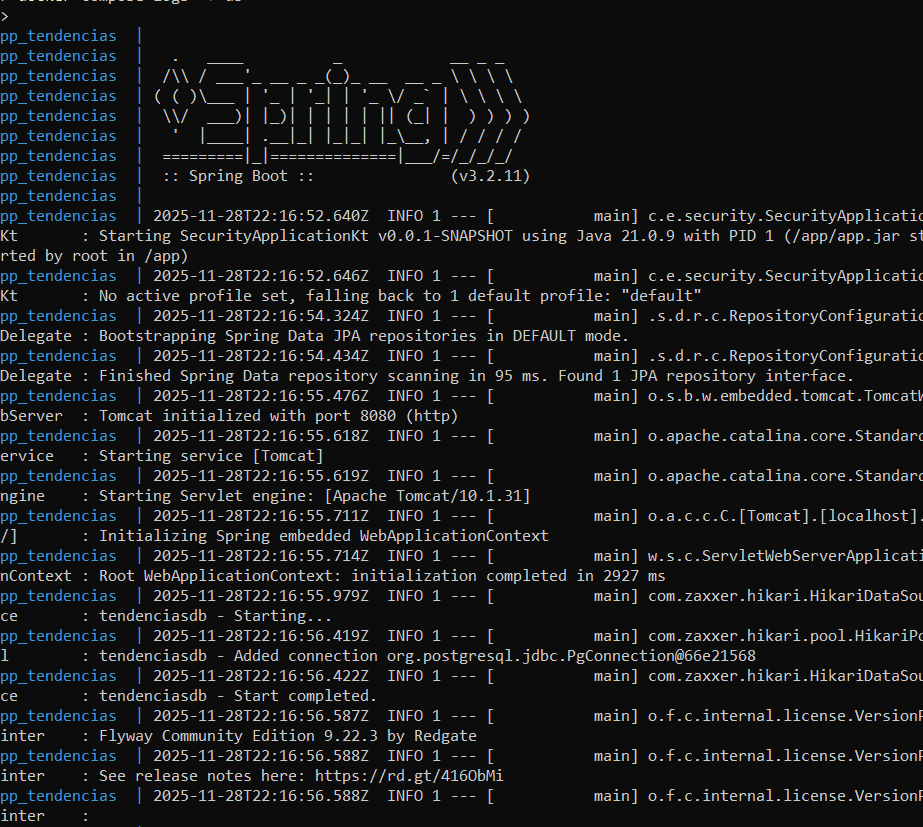
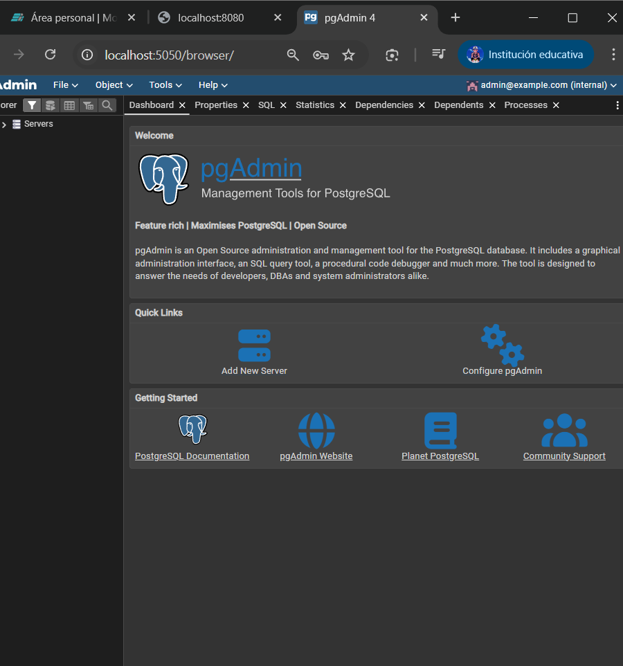

# Practica servidor web
## 1. Titulo
Automatización del despliegue de un servidor web utilizando Docker, Docker Compose y contenedores Nginx, PostgreSQL y Backend.
## 2. Tiempo de duración
90 minutos
## 3. Fundamentos:

En esta práctica se estudia y aplica el uso de contenedores mediante Docker para automatizar el despliegue de un entorno web completo compuesto por tres elementos fundamentales: un servidor web (Nginx), una base de datos (PostgreSQL) y un servicio backend desarrollado en Java/Kotlin. Docker permite empaquetar cada servicio de forma independiente dentro de contenedores aislados, garantizando que el entorno de ejecución sea idéntico sin importar el sistema operativo del estudiante o del servidor.

El concepto principal detrás de Docker es la contenedorización, que consiste en ejecutar aplicaciones en entornos ligeros y aislados llamados contenedores. A diferencia de las máquinas virtuales tradicionales, los contenedores no requieren un sistema operativo completo para cada instancia, sino que comparten el kernel del host. Esto los hace más rápidos, más ligeros y más eficientes. En esta práctica se usa además Docker Compose, una herramienta diseñada para definir y ejecutar aplicaciones multicontenedor utilizando archivos YAML. Compose permite describir redes, volúmenes, variables de entorno y dependencias entre servicios, de manera que el estudiante pueda levantar una arquitectura completa con un solo comando.

Otro concepto clave de esta práctica es el uso de imágenes multi-stage, una técnica avanzada en Docker que permite crear imágenes mucho más optimizadas. La idea es usar una imagen grande durante la compilación (por ejemplo, una imagen con Maven y JDK) y luego copiar solo el resultado final a una imagen ligera que se ejecutará en producción. Este enfoque reduce el tamaño de la imagen, mejora los tiempos de despliegue y disminuye el consumo de recursos.

Finalmente, se exploran temas como redes en Docker, persistencia mediante volúmenes, configuración de variables de entorno con archivos .env y el uso de herramientas de administración como pgAdmin para gestionar la base de datos PostgreSQL.

## 4. Conocimientos previos.
   
Comandos Linux (navegación, creación de archivos, permisos).

Manejo de terminal en Windows.

Fundamentos de redes (puertos, IPs, comunicación entre servicios).

Navegación en navegador web.

Conceptos fundamentales de servidor web.

Concepto de backend, base de datos y comunicación cliente-servidor.

Instalación de Docker Desktop.

## 5. Objetivos a alcanzar
   
Implementar contenedores utilizando Docker y Docker Compose.

Configurar un servicio web con Nginx.

Crear y administrar contenedores de base de datos PostgreSQL.

Acceder y gestionar la base de datos mediante pgAdmin.

Construir una imagen personalizada de un backend usando un Dockerfile multi-stage.

Manipular archivos de configuración para automatizar despliegues.

Definir redes y volúmenes persistentes.

Levantar la arquitectura completa en un solo comando.
  
## 6. Equipo necesario:
  
Computador con sistema operativo Windows.

Docker Desktop instalado.

Visual Studio Code.

Cuenta en Docker Hub.

Navegador Web.

Acceso a Internet para descargar imágenes.

Git instalado para clonar el proyecto base.

## 7. Material de apoyo.
   
Documentación oficial de Docker: https://docs.docker.com

Guía de laboratorio de la asignatura.

Docker Cheat Sheet.

Documentación oficial de PostgreSQL.

Documentación oficial de pgAdmin.
  
## 8. Procedimiento

Paso 1: Clonar el proyecto

Abrir PowerShell como administrador y ejecutar:

git clone https://github.com/maguaman2/tendencias-mar22-security.git
cd tendencias-mar22-security

Paso 2: Crear los archivos necesarios

Crear los archivos dentro del proyecto:

New-Item Dockerfile
New-Item docker-compose.yml
New-Item .env
New-Item .dockerignore

Paso 3: Editar el archivo .env

Paso 4: Escribir el Dockerfile multi-stage

Paso 5: Crear docker-compose.yml

Definir los servicios:

db → PostgreSQL

pgadmin → herramienta de administración

app → backend construido con el Dockerfile

Paso 6: Levantar los contenedores

En PowerShell:

docker compose up --build -d

Paso 7: Verificación de estado

Revisar logs:

docker compose logs -f app
docker compose logs -f db

Paso 8: Acceso a los servicios

Backend → http://localhost:8080

pgAdmin → http://localhost:5050

## 9. Resultados esperados:
    
Deberá observar que PostgreSQL persiste datos gracias al volumen definido.

Deberá acceder a pgAdmin mediante navegador y visualizar la base de datos.

El backend deberá iniciar correctamente y conectarse a PostgreSQL usando variables definidas en .env.

Capturas de pantalla esperadas:

Docker Desktop mostrando los contenedores activos.

pgAdmin conectándose a PostgreSQL.

Salida de logs del backend indicando conexión exitosa.

Respuesta exitosa desde un endpoint del servidor web.

## 10. Bibliografía
    
Docker. (2024). Docker Documentation. https://docs.docker.com

PostgreSQL Global Development Group. (2024). PostgreSQL Documentation.

pgAdmin Team. (2024). pgAdmin Documentation.

OpenJDK. (2024). Documentation for Java 17.

Apache Maven Project. (2024). Maven Official Documentation.
